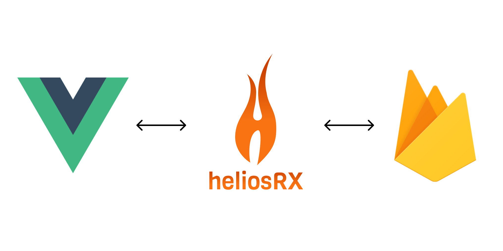

<h1 align="center">heliosRX</h1>



<p align="center">
  <a href="http://badge.fury.io/js/heliosrx" alt="NPM">
    
  </a>
  <a href="https://github.com/heliosrx/heliosrx/pulse" alt="Activity">
    
  </a>
  <a href="https://discord.gg/2Hg3eq" alt="Discord">
    
  </a>
  <a href="https://twitter.com/intent/follow?screen_name=helios_rx">
    
  </a>
  <!--
  <a href="https://cdnjs.com/libraries/heliosrx" alt="CDNJS">
    
  </a>
  <a href="https://github.com/heliosrx/heliosrx/graphs/contributors" alt="Contributors">
    
  </a>
  <a href="#backers" alt="Backers on Open Collective">
    
  </a>
  <a href="#sponsors" alt="Sponsors on Open Collective">
    
  </a>
  <a href="https://github.com/heliosrx/heliosrx/compare/dev...master">
    
  </a>
  <a href="https://circleci.com/gh/heliosrx/heliosrx/tree/master">
    
  </a>
  <a href="https://circleci.com/gh/heliosrx/daily-tests">
    
  </a>
  <a href="https://travis-ci.org/heliosrx/heliosrx" alt="Travis CI">
    
  </a>
  <a href="https://coveralls.io/github/heliosrx/heliosrx">
    
  </a>
  <a href="https://lgtm.com/projects/g/heliosrx/heliosrx/alerts/">
    
  </a>
  -->
</p>

**heliosRX** is a front-end ORM (Object-Relational Mapping) layer
for reactive real-time web applications using Firebase Realtime Database.
heliosRX allows developers to define `models` based on schema files.

<!--
Firebase Realtime Database is a managed NoSQL database hosted on
the Google Cloud infrastructure, that allows to save and retrieve data from a
JSON-like structure.
-->

- ✌️ Currently supports Vue and Firebase.
- 🍭 Easy to use abstraction layer for firebase
- ⚡ Speeds up development significantly
- 🔌 Modular architecture (will support other backends in the future)
- ⏱️ Write fully reactive Realtime Apps

## When should I use heliosRX?

If your using Firebase as your backend and if you're building an SPA that
is a little bit more complex then a simple todo list, then heliosRX is
probably very useful for you. Some benefits of using heliosRX over
just Firebase Client API are:

- ➡️ Easy, straight forward API based on model definitions/schemata
- ➡️ Define schemas and locations for your data
- ➡️ Consistent data validation on client and server
- ➡️ Automatically generate Security Rules based on schema
- ➡️ Allows easy sorting of objects
- ➡️ Automatic type conversion for timestamps to moment-js
- ➡️ Additional layer of abstraction and therefor less vendor lock-in
- ➡️ State management, no `Vuex` needed (although heliosRX uses Vuex internally)
- ➡️ Write significantly less code

## Install

1. Install with npm

```bash
npm install --save heliosrx
```

2. Install with yarn

```bash
yarn add heliosrx
```

heliosRX comes with CLI:

```bash
npm install -g heliosrx-cli
# - or -
yarn global add heliosrxc-cli
```

heliosRX requires bolt-compiler as a peer dependency, so please run:

```bash
npm install -g bolt-compiler
# - or -
yarn add -g bolt-compiler
```

## Configuration

Before you can start using heliosRX, you have to configure Firebase and heliosRX.
Usually this should be very simple.

### Configure Firebase Realtime Database

This is really up to you, but one way to do it, is to get your Firebase
configuration and put it in a new file in `src/firebase.js` that looks
something like this:

```js
// file: src/firebase.js

// Firebase App (the core Firebase SDK) is always required and must be listed first
import * as firebase from "firebase/app";

// Add the Firebase products that you want to use
import "firebase/auth";
import "firebase/database";

// TODO: Replace the following with your app's Firebase project configuration
const firebaseConfig = {
  apiKey:            "<YOUR API KEY>",
  authDomain:        "<YOUR AUTH DOMAIN>",
  databaseURL:       "<YOUR DATABSE URL>",
  projectId:         "<YOUR PROJECT ID>",
  storageBucket:     "<YOUR STORAGE BUCKET>",
  messagingSenderId: "<YOUR MESSAING SENDER ID>",
  appId:             "<YOUR APP ID>"
};

// Initialize Firebase
firebase.initializeApp(firebaseConfig);

// Initialize Realtime DB
export const rtdb = firebase.database();
```

Please feel free to do this in a way that suits your needs best.
The important thing here is that we need to import `rtdb` later on,
which is why we're exporting it here.

### Create folder structure and configuration files

Next create the following folder structure:

```
└── rules
    └── rules.bolt      - Database access rules
└── src
    ├── api             - Additional user API
    └── models
        ├── config.js   - Models are assigned to DB paths here
        └── *           - Model definitions (Can be accessed through this.$models)
```

by running

```bash
helios init
```

which will create these files and folders automatically.

### Add heliosRX to your main.js

```js
import Vue from 'vue'
import heliosRX from 'heliosRX'
import { rtdb } from './firebase' // Import realtime database
import models from '@/models'

Vue.use(heliosRX, {
  userModels:  models, // 'src/models',
  devMode:     true,
  firebaseDb:  rtdb
})

...

new Vue({
  render: h => h(App)
}).$mount('#app');
```

## Quickstart

This is an example for a simple To-Do App:

- [Demo](https://heliosrx-demo1.web.app/)

### 1. Define a Schema

```js
const taskModelDefinition = {
  schema: {
    fields: {
      title:     { validate_bolt_type: 'String', required: true },
      createdAt: { validate_bolt_type: 'ServerTimestamp' },
      isDone:    { validate_bolt_type: 'Boolean' },
    }
  }
};

export const task = new GenericStore( '/user/{userId}/task/*', taskModelDefinition );
```

### 2. Use auto-generated API

```html
<template>
  <!-- Example: Simple To-Do App -->
  <ul>
    <li v-for="task in tasks.items" :key="task.$key">
      <input type="checkbox" @input="onCheckTask( task )">
      {{task.title}}
      <a href="#" @click.prevent="onDeleteTask( task )" />
    </li>
    <input v-model="title" />
    <button @click="onAddTask" />
  </ul>
</template>

<script>
export default {
  data() {
    return {
      title: ""
    }
  },
  computed: {
    tasks() {
      return this.$models.task.subscribeList();
    }
  },
  methods: {
    onCheckTask( task ) {
      task.isDone = !task.isDone;
      task.save();
      // or: this.$models.task.update( task.$id, { isDone: !task.isDone } )
    },
    onAddTask() {
      this.$models.task.add({
        title: this.title
      });
    },
    onDeleteTask( task ) {
      task.remove();
      // or: this.$models.task.remove( task.$id );
    }
  }
}
</script>
```

### 3. Generate Security Rules automatically

```bash
> helios rules --write <output-file>

type Task {
  title: String
  createdAt: ServerTimestamp | Null
  isDone: Boolean | Null
}
...
```

## Documention

- **[Full Documentation](https://heliosrx.github.io)**

<!--
## Backers
TODO
-->

<!--
## Changelog
See [CHANGELOG.md](./CHANGELOG.md).
-->

<!--
## Generate documentation
Run `npx gulp api` which will build the documentation files and place them in the api folder.
-->

## Pull request

I'd be happy to review any pull requests that may better the heliosRX project, in particular if you have a bug fix, enhancement, or a new shape (see src/shapes for examples). Before doing so, please first make sure that all of the tests pass (gulp lint test).
