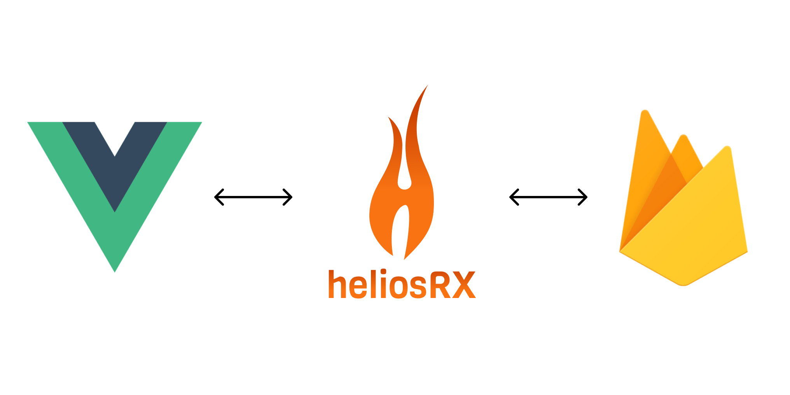
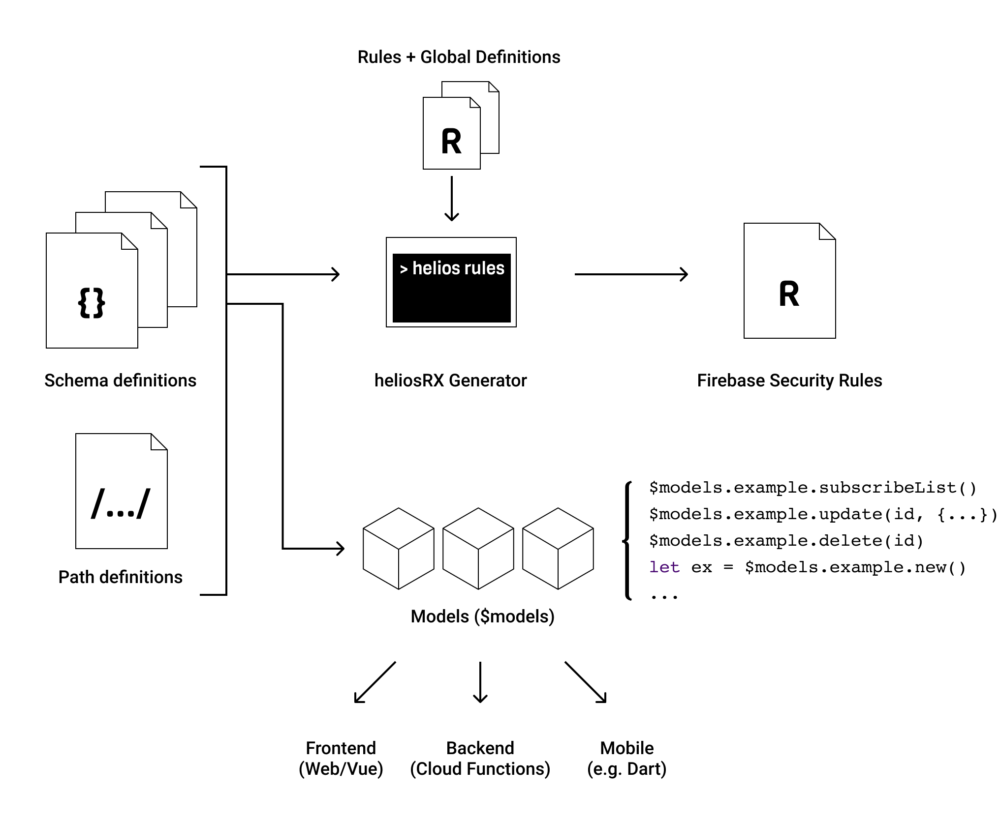

# Introduction

**heliosRX** is a front-end ORM layer for reactive real-time web applications.
It is build on top of Firebase Realtime DB, a managed NoSQL database hosted on
the Google Cloud infrastructure, that allows to save and retrieve data from a
JSON-like structure. For bigger applications enforcing some structure simplifies
life a lot. With heliosRX developers can define `models` based on schema files.

heliosRX consists of two parts: A generator that can generate security rules
from schema files and a javascript ORM library that gives a nice abstraction to
Realtime Database.

Currently heliosRX is build for Vue and Firebase Realtime Database, but other
backend integrations are planned.

Another goal of heliosRX is to target different platforms with a shared codebase
and provide a unified API to the database for different platforms:

- Babel for Web / Desktop
- Dart / Flutter for Mobile
- Node for admin tools and cloud functions

The generic API includes a description of the database including:

- Storage paths (refs)
- Schemata
- Input validation rules

## What is heliosRX?

...

## Benefits of heliosRX

The benefits of using heliosRX over just Firebase Client API are:

- ➡️ Easy, straight forward API based on `model definitions`
- ➡️ Write significantly less code
- ➡️ Define schemas and locations for your data
- ➡️ Consistent data validation on client and server
- ➡️ Automatically generate Security Rules based on Schema
- ➡️ Additional layer of abstraction and therefor less vendor lock-in

## How it works

heliosRX used the bolt language and the [bolt compiler](https://github.com/FirebaseExtended/bolt).
