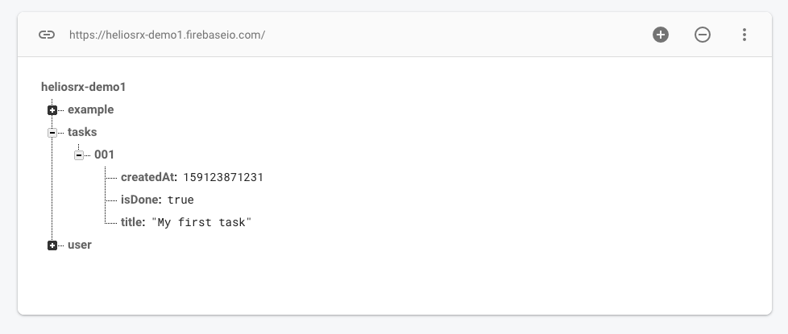

# 5-Minute Intro

::: tip
This guide is a quick starter. After going through this guide, you will be able
to define models, access data through your models, subscribe to realtime data
and create and update data. We will use a simple **todo app** as an example.
:::

Before you start, you probably want to create a new Firebase project in the
[Firebase console](https://console.firebase.google.com/). Also go to `Database`
and create a new *Realtime Database* with "Start in **production mode**" security rules.

## Step 1: Create a task model

First let's create a new model in `src/models/task/`:

```touch
mkdir -p src/models/task
touch src/models/task/schema.js
```

The model has three fields. A `title`, a creation date `createdAt` and a flag
`isDone` that indicates wether the task is finished or not. Let's create a
model definition first:

```js
export default {
  fields: {
    title:     { validate_bolt_type: 'String', required: true },
    createdAt: { validate_bolt_type: 'ServerTimestamp' },
    isDone:    { validate_bolt_type: 'Boolean' },
  },
};
```

This defines a model with a required field `title` and two optional fields.
Next we create a `GenericStore`, which gives us access to data stored in
realtime db through a object oriented interface. A `GenericStore` serves
as a factory class, that will spawn model instances and lists of model models
instances. More an that later. First edit `src/models/config.js` like this:

```js
import taskModelDefinition from './task';

export const task = new GenericStore(
  "/tasks/*",
  featureModelDefinition
);
```

We also define here, where the data is stored in realtime database. As you can
see `GenericStore` takes two arguments. The first argument is the location of
the data (see [path syntax](../api/01-generic-store.md#path-syntax)). The
second argument is a model definition, which we just created.

`*` is a placeholder for the (unique) id of the object. Once we have written
data to realtime database it should correspond to something like this:



Next we create a security rule `db/rules/rules.bolt`:

```bolt
path /tasks is Task[] {
  read() { isSignedIn() }
  write() { isSignedIn() }
}
```

If you're not familiar, this is the [bolt syntax](https://github.com/FirebaseExtended/bolt).
heliosRX automatically generate bolt files, which are compiled to security rules
using the `bolt-compiler`. Lean more [here](./01-intro).

Now let's also add a `create` function, which (if present) will set default values,
when a new instance of this model is created:

```jsx
import moment from '@/moment-gp'

export default {
  create({ title }) {
    return {
      title:     "Undefined title" || title,
      createdAt: moment.currentTimeServer('REALTIMEDB'),
      isDone:    false,
    };
  },
  // --- see above
  fields: {
    title:     { validate_bolt_type: 'String', required: true },
    createdAt: { validate_bolt_type: 'ServerTimestamp' },
    isDone:    { validate_bolt_type: 'Boolean' },
  },
};
```

`title` is a required field and should therefor be passed to the create function.
If we forget to provide it when creating a new task instance, we'll get an error.
`moment.currentTimeServer` is a helper function that creates a special field,
which will be replaced with the current timestamp on the server.

Next we generate and deploy the security rules. heliosRX will automatically
generate a `.bolt` file for every model and merge it with `rules.bolt` into
`/database.bolt` which is then compiled to `/database.json`.

```sh
helios gen && firebase deploy --only database
```

Now we're ready to read and write data to the firebase realtime database.

## Step 2: Subscribe to data

Create a new `.vue` component anywhere you want. Let's have a look at how we
can use the model to fetch data or subscribe to data (keep data synced, when
it changes on the server). First, let's look at a example, where we are
syncing all data in `/tasks/*` as a list of `GenericModels`:

```js
<template>
  <pre>{{tasks}}</pre>
</template>

<script>
export default {
  computed: {
    tasks() {
      return this.$models.task.subscribeList();      
    }
  },
}
</script>
```

If we just want to sync a single node, like `/tasks/hg23asd763h2g4` we can use
`subscribeNode` insted.

```js
<template>
  <pre>{{task}}</pre>
</template>

<script>
let taskId = 'hg23asd763h2g4';

export default {
  computed: {
    task() {
      return this.$models.task.subscribeNode(taskId);      
    }
  },
}
</script>
```

Usualy what we want to do with a list is to loop through it's elements like this:

```html
<template>
  <ul>
    <li v-for="task in tasks.itemsAsArray()" :key="task.$key">
      {{task.title}}
    </li>
  </ul>
</template>
```

heliosRX provides a auto-generate `$key` which can be used with `v-for` loops.
Also `GenericList`'s provide helper functions for sorting and filtering lists.

::: tip
A `$key` is automatically generated for each model instance.
:::


## Step 3: Write data

asdjhadsahsj sajhasd

```js
<template>
  <div>
    <pre>{{tasks}}</pre>
    <button @click="addItem1">Add Item</button>
    <button @click="addItem2">Add Item</button>
  </div>
</template>

<script>
export default {
  // ...
  methods: {
    addItem1() {
      this.$models.tasks.add({ title: "Foobar" });
    },
    addItem2() {
      let task = this.$models.tasks
    }
  }
}
</script>
```

```js
<template>
  <div>
    <pre>{{tasks}}</pre>
    <input v-model="task.title" />
    <button @click="addItem2">Add Item</button>
  </div>
</template>

<script>
export default {
  created() {
    this.task = this.$models.add.new_from_template();
  }
  // ...
  methods: {
    addItem2() {
      this.task.save();
    }
  }
}
</script>
```

## Bonus: Nested data


```json
{ output... }
```


### Demo

Demo here
