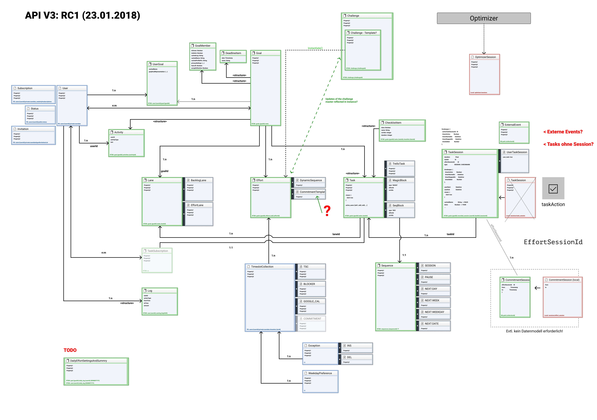

# Advanced topics

## Custom functions

```js
// Checks if user is a specific (authenticated) user
function isUser(uid) { auth != null && auth.uid == uid }
function isConfirmedUser(uid) { auth != null && auth.uid == uid }

//
function isSignedIn() { auth != null }

// Check if user has custom claim 'admin' (not to be confused with 'admin sdk' access)
function isAdmin() { auth.token.admin === true }

// Check if user has custom claim 'admin'
function isDeveloper() { auth.token.developer === true || isAdmin() }

// Check if user has custom claim 'support'
function isSupport() { auth.token.support === true || isAdmin() || isDeveloper() }

// Check if user has a premium subscription
function isPremiumUser() { auth.token.premium === true }

// Check if user is a free user
function isFreeUser() { !auth.token.premium }

// Check if emails is verified
function emailVerified() { auth.token.email_verified === true }
```

## Database structure

### DB Structure


### Relationship Diagram


