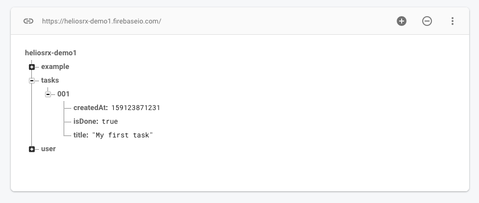

# Quick Introduction
<!-- # 5-Minute Intro -->

::: tip
This guide is a quick starter. After going through this guide, you will be able
to define models, access data through your models, subscribe to realtime data
and create and update data. We will use a simple **todo app** as an example.
A working demo of what we're going to build can be found here:
[Demo](https://eager-xxx-yyy.netlify.com/demo1)
:::

Before you start, you probably want to create a new Firebase project in the
[Firebase console](https://console.firebase.google.com/). Also go to `Database`
and create a new *Realtime Database* with "Start in **production mode**" security rules. before you start please consult the [configuration guide](../03-configuration)
in order to setup heliosRX and Firebase.

## Step 1: Create a Model

First let's create a new model in `src/models/task/` for tasks:

```touch
mkdir -p src/models/task
touch src/models/task/schema.js
```

The model has three fields. A `title`, a creation date `createdAt` and a flag
`isDone` that indicates wether the task is finished or not. Let's create a
model definition first:

```js
// file: src/models/task/schema.js
export default {
  fields: {
    title:     { validate_bolt_type: 'String', required: true },
    createdAt: { validate_bolt_type: 'ServerTimestamp' },
    isDone:    { validate_bolt_type: 'Boolean' },
  },
};
```

This defines a model with a required field `title` and two optional fields.
Next we create a `GenericStore`, which gives us access to data stored in
realtime db through a object oriented interface. A `GenericStore` serves
as a factory class, that will spawn model instances and lists of model models
instances. More an that later. First edit `src/models/config.js` like this:

```js
// file: src/models/config.js
import taskModelDefinition from './task';

export const task = new GenericStore(
  "/tasks/*",
  featureModelDefinition
);
```

We also define here, where the data is stored in realtime database. As you can
see `GenericStore` takes two arguments. The first argument is the location of
the data (see [path syntax](../api/01-generic-store.md#path-syntax)). The
second argument is a model definition, which we just created.

`*` is a placeholder for the (unique) id of the object. Once we have written
data to realtime database it should correspond to something like this:



Next we create a security rule `db/rules/rules.bolt`:

```bolt
// file: db/rules/rules.bolt
path /tasks is Task[] {
  read() { isSignedIn() }
  write() { isSignedIn() }
}
```

If you're not familiar, this is the [bolt syntax](https://github.com/FirebaseExtended/bolt).
heliosRX automatically generate bolt files, which are compiled to security rules
using the `bolt-compiler`. Lean more [here](./01-intro).

Now let's also add a `create` function, which (if present) will set default values,
when a new instance of this model is created:

```js
// file: src/models/task/schema.js
import moment from 'heliosrx/moment' // This is actually a enhanced version of moment

export default {
  create({ title }) {
    return {
      title:     "Undefined title" || title,
      createdAt: moment.currentTimeServer('REALTIMEDB'),
      isDone:    false,
    };
  },
  // --- see above
  fields: {
    title:     { validate_bolt_type: 'String', required: true },
    createdAt: { validate_bolt_type: 'ServerTimestamp' },
    isDone:    { validate_bolt_type: 'Boolean' },
  },
};
```

`title` is a required field and should therefor be passed to the create function.
If we forget to provide it when creating a new task instance, we'll get an error.
`moment.currentTimeServer` is a helper function that creates a special field,
which will be replaced with the current timestamp on the server.

Next we generate and deploy the security rules. heliosRX will automatically
generate a `.bolt` file for every model and merge it with `rules.bolt` into
`/database.bolt` which is then compiled to `/database.json`.

```bash
helios gen && firebase deploy --only database
```

Now we're ready to read and write data to the firebase realtime database.

## Step 2: Subscribe to data

Create a new `.vue` component anywhere you want. Let's have a look at how we
can use the model to fetch data or subscribe to data (keep data synced, when
it changes on the server). First, let's look at a example, where we are
syncing all data in `/tasks/*` as a list of `GenericModels`:

```js
// file: src/components/Demo1.vue
<template>
  <pre>{{tasks}}</pre>
</template>

<script>
export default {
  computed: {
    tasks() {
      return this.$models.task.subscribeList();
    }
  },
}
</script>
```

Easy right? Let's actually make it a little bit more realistic by looping through
the list of model instances:

```html
<template>
  <ul>
    <li v-for="task in tasks.itemsAsArray()" :key="task.$key">
      {{task.title}}
    </li>
  </ul>
</template>
```

heliosRX provides a auto-generate `$key` which can be used with `v-for` loops.
Also `GenericList`'s provide helper functions for sorting and filtering lists,
see [api/generic-list](/api/03-generic-list).

::: tip
A `$key` is automatically generated for each model instance.
:::

If we just want to sync a single node, like `/tasks/-Lw_jEwrxiM6d2fS0n2m` we can use
`subscribeNode` instead.

```js
<template>
  <pre v-if="task.$ready">{{task}}</pre>
</template>

<script>
let taskId = '-Lw_jEwrxiM6d2fS0n2m';

export default {
  computed: {
    task() {
      return this.$models.task.subscribeNode(taskId);
    }
  },
}
</script>
```

This will automatically re-render the template if the data changes on the server.
`GenricList` and `GenericModel` are fully reactive. Another reactive
"magic property" that `GenericModel` provides is `$ready` which will become
`true` as soon as the data is loaded and the pushe to the local state.

If you're not interested in subsequent updates and only want to fetch the data
once, you can use ```fetchList``` and ```fetchNode``` with the exact same syntax.

## Step 3: Write data

Ok, we now know how to subscribe to data and render it, in other words how
information flows from the server to the client. Next we have a look how data
flows in the opposite direction.

First let's create a new task. The easiest way to do so is by calling the `add`
method of the GenericStore.

```js
<template>
  <div>
    <pre>{{tasks}}</pre>
    <button @click="addItem">Add Item</button>
    <button @click="updateItem">Update Item</button>
  </div>
</template>

<script>
export default {
  // ...
  methods: {
    addItem() {
      this.$models.task.add({ title: "Foobar" });
    },
    updateItem() {
      // The first argument of update is always the id
      this.$models.task.update( "-Lw_jEwrxiM6d2fS0n2m", { title: 'New title' });
    }
  }
}
</script>
```

This will in fact call our `create` function that we defined in the model and
then write it to the database.

::: tip
Firebase (and heliosRX) will update the local state in the client. This means
that the template will update and show the new data. However if the data can
not be written, for example because the client does not have permission.
Firebase will trigger a second local state update which basically reverses
the initial change.

This means you usually don't have to worry about managing your view during
a write process.
:::

There are also a two factory methods, which can create a new `GenericModel`:

- `new()` - Create empty model from schema (without calling create function)
- `new_from_template( data )` - Create empty model using create function

```js
<template>
  <div>
    <pre>{{tasks}}</pre>
    <button @click="addItem">Add Item</button>
  </div>
</template>

<script>
export default {
  methods: {
    addItem() {
      let task = this.$models.task.new_from_template({ title: "Foobar" })
      task.title = 'My updated title';
      task.isDone = true;

      task.save();
    }
  }
}
</script>
```

This is especially useful, when the component has a modal / form characteristics.
Also heliosRX will provide client side validation:

```js
<template>
  <div>
    <pre>{{tasks}}</pre>
    <input v-model="task.title" /> <!-- will automatically sync to the task -->
    <button @click="addItem">Add Item</button>
  </div>
</template>

<script>
export default {
  created() {
    // Create empty task when component is created
    this.task = this.$models.add.new_from_template({ title: "Foobar" });
  }
  methods: {
    addItem() {
      // Check if all task fields have valid values
      if ( this.task.$isValid() ) {
        // Write task to db ()
        this.task.save();
      } else {
        // Handle invalid user input
      }
    }
  }
}
</script>
```

This is all it takes to write a realtime web applications with heliosRX!

### A few more things

- Almost all "write" methods in heliosRX will return a promise. Usually the
first argument is the `id` of the (newly created) object

```js
this.$models.task.add().then(id => {
  console.log(`task with id ${id} created`);
});
```

- "read" methods don't return a promise because they already return a reactive
model instead, but `GenericModel` and `GenericList` will provide a promise, that
resolves as soon as *all* data is ready as the `$promise` property:

```js
let ex = this.$models.example.subscribeList();
ex.$promise.then(() => {
  console.log("'ex' is ready");
})
```

- heliosRX supports different validation methods, which can be configured. By
default validations are derived from the datatype, but additional validation
rules can be configured (e.g. "string must not exceed 30 characters").

- heliosRX automatically convert all datatypes containing `"Timeststamp"` to
[moment objects](http://momentjs.com/), also whenever a field is set to a
moment object it will automatically convert it to a timestamp. This makes dealing
with timestamps very convenient compared to standard firebase.

- In development mode you can access `$models` and `$api` in the console. This
gives you a pretty powerful tool to change data from your browser.

- `GenericModel`'s provide many other useful "magic properties", such as `$dirty` for all fields that have been changed by the user or `$noaccess`, which will be
set to `true` if the client does not have access to the requested data.

- heliosRX does NOT automatically infer local validation rules from firebase
 server validation rules, however both client and server rules can be defined
 in ONE PLACE, which makes it very easy to ensure consistency between server and client.

- One of the strengths of heliosRX is dealing with **nested data**. We didn't cover
that here. Imagine your data is structured like this:

```
/project/{projectId}/user/{userId}/task/{taskId}
```

heliosRX provides a straight forward API to deal with this. Keep on reading
if you want to learn [more](../tutorial/02-nested-data).
