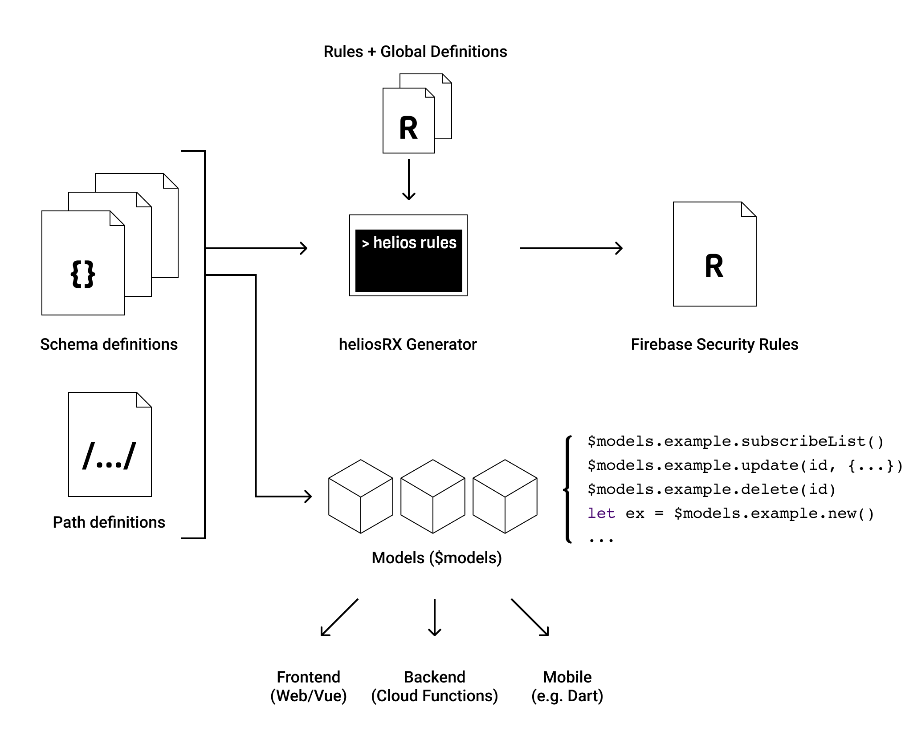

# Introduction

## What is heliosRX?

**heliosRX** is a front-end ORM (Object-Relational Mapping) layer
for reactive real-time web applications using Firebase Realtime Database.
heliosRX allows developers to define `models` based on schema files.

<!--
Firebase Realtime Database is a managed NoSQL database hosted on
the Google Cloud infrastructure, that allows to save and retrieve data from a
JSON-like structure.
-->

While using the Firebase Client API is fine for smaller applications, enforcing
some structure is almost necessary to successfully manage more complex applications.
Enforcing structure simplifies life a lot and gives you the best of both
the NoSQL and the SQL world.
<!--
If ORM and NoSQL seems counter intuituve to you, read more [here](/guide/tutorial/08-relations).
-->

heliosRX consists of two parts: A generator that can generate security rules
from schema files, thus creating a data model for the server, and a javascript
ORM library, that creates a nice abstraction to Realtime Database based on the
exact same data model. The basic idea here is: **Describe a model once, reuse
it as much as possible**. Another goal of heliosRX is therefor to target
different platforms with a shared codebase and provide a unified API to
the database for different platforms, such as:

- Babel for Web / Desktop
- Node for admin tools and cloud functions
- Dart / Flutter for Mobile (planend)

<!--
The generic API includes a description of the database including:

- Storage paths (refs)
- Schemata
- Input validation rules
-->

While currently heliosRX is build for Vue and Firebase Realtime Database,
other backend integrations might get implemented in the future (e.g. GraphQL).

## When should I use heliosRX?

If you're using Firebase as your backend and if you're building a SPA that
is a little bit more complex than a simple to-do list, then heliosRX is
probably very useful for you. Some reasons you might chose heliosRX over
just the Firebase Client API are:

- ➡️ You want to develop a SPA with Vue and Firebase
- ➡️ You want to write significantly less code
- ➡️ You want to automatically generate *Security Rules* based on schema definitions
- ➡️ You want consistent data validation on client and server
- ➡️ You want an additional layer of abstraction and therfore less vendor lock-in
- ➡️ You want automatic type conversion for timestamps
- ➡️ You want object oriented state management - No `Vuex` needed (although heliosRX currently uses Vuex internally, which will probably change with Vue 3)

If that makes sense to you, you should give heliosRX a try.

## How it works

To understand how heliosRX works, have a look following picture. Basically the
database is specified by (1) model definition files, that describe *which* fields
can be stored and (2) a path definition file, that describes *where* data is
stored.

heliosRX uses the bolt language and the [bolt compiler](https://github.com/FirebaseExtended/bolt). The model definitions can then be used to create bolt files, which are merged and
then compiled to Firebase security rules.

Also heliosRX generates an API that can be used to access the database in a straight
forward way. Based on the model definition, model instances can be created from
existing or new data. Under the hood heliosRX creates a new `Vue` instance within
each model instance. These intances manage state and reactivity, so you probably
don't need an additional state management.

<!--
TODO: Mention other similar libs
-->
